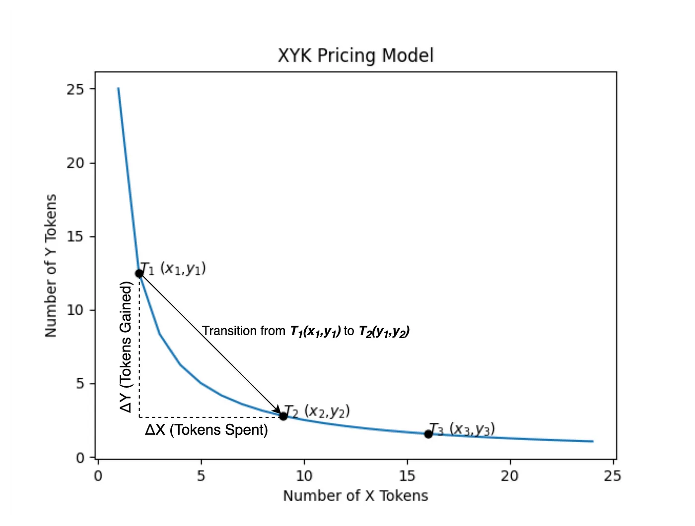

## Defi Swap

This repository contains a simple smart contract implementation of the x \* y = k pricing model, popular in many automated market makers.

## Purpose

The code in this repository is for research and learning purposes only. Do not deploy and execute the code with real assets.

## AMM Pricing

For more details, see my article, [An Introduction to Automated Market Making](https://medium.com/codex/an-introduction-to-automated-market-making-994bc76c61f4).

